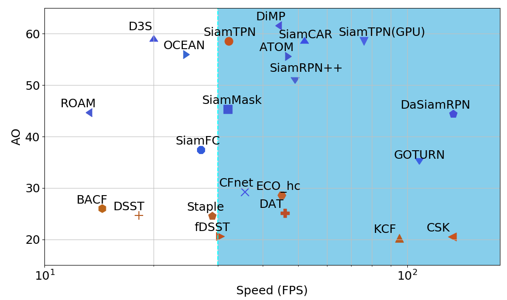

# SiamTPN

## Introduction

This is the official implementation of the SiamTPN (WACV2022). The tracker intergrates pyramid feature network and transformer into Siamese network, achieving state-of-the-art performance (better than DiMP) while runing 30 FPS on a single CPU.  The tracker optimized with ONXX and openvino could run at 45 FPS on cpu end, leading promising performance when deploying on drones for tracking.



[\[Paper\]](https://arxiv.org/abs/2110.08822)  [\[Raw Results\]](https://drive.google.com/drive/folders/1YUzqgifqhXVK_PrQNg5w467EGlX9yG-M?usp=sharing)   [\[Drone Tracking Videos\]](https://drive.google.com/drive/folders/1joOkom2sDZ-Ke2eyYIQX5redjpku38Lk?usp=sharing)  [\[Models\]](https://drive.google.com/drive/folders/1Aryamx7-UP9G3R9_Zn7IJ95Iyl3soVQx?usp=sharing)

## Training

### prepare data
change the path in `lib/train/admin/local.py ` to your data location

```
# Distributed training withh 4 nodes 
python -m torch.distributed.launch --nproc_per_node 4 tools/run_training.py --config shufflenet_l345_192
```

```
# single gpu training for test purpose
python tools/run_training.py --config shufflenet_l345_192
```


## Test and evaluate SiamTPN

### prepare data
change the path in `lib/test/evaluation/local.py ` to your data location

### running on cpu 

```
# Download the pretrain model and put it under ./results/checkpoints/train/SiamTPN/ folder

python tools/test.py siamtpn shufflenet_l345_192 --dataset_name got10k_val --debug 1 --cpu 1 --epoch 100 --sequence GOT-10k_Val_000001
```

### running on cpu with onnx optimized

The debug mode will show tracking results, more details refer to tools/test.py

Currently, onnx only support cpu version

First, you need to install onxx and onxxruningtime:

```
pip install onxx
# for onxx runining time, download the openvino version from release [page](https://github.com/intel/onnxruntime/releases/tag/v3.1) and install with
pip install onnxruntime_openvino-1.9.0-cp37-cp37m-linux_x86_64.whl

# please refer the [page](https://github.com/intel/onnxruntime/releases/tag/v3.1) for openvino installation details.
```

```
# Download the converted onnx model and put it under ./results/onnx/ folder
# or conver your own model with 
python tools/onnx_search.py
python tools/onnx_template.py

python tools/test.py siamtpn_onnx shufflenet_l345_192 --dataset_name got10k_val --debug 1 --cpu 1 --epoch 100 --sequence GOT-10k_Val_000001
```


## Citation
If you find this repo useful, please cite with
```
@article{xing2021siamese,
  title={Siamese Transformer Pyramid Networks for Real-Time UAV Tracking},
  author={Xing, Daitao and Evangeliou, Nikolaos and Tsoukalas, Athanasios and Tzes, Anthony},
  journal={arXiv preprint arXiv:2110.08822},
  year={2021}
}
```


## Acknowledge
Our code is implemented based on the following libraries:
* [PyTracking](https://github.com/visionml/pytracking)
* [Stark](https://github.com/researchmm/Stark)
* [Timm](https://github.com/rwightman/pytorch-image-models)


